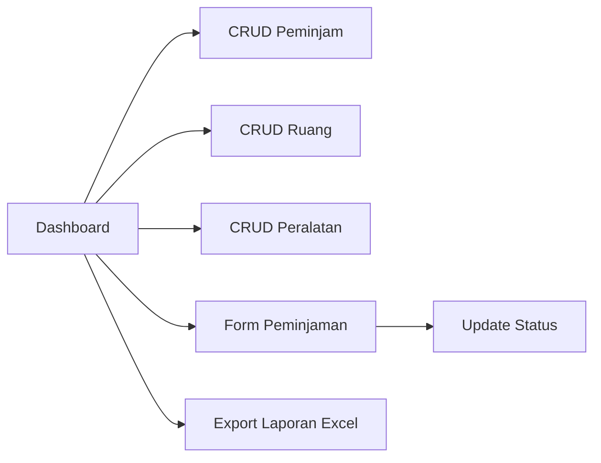
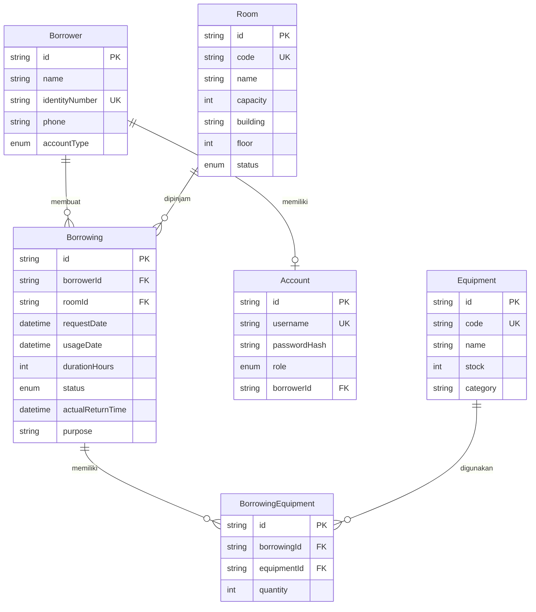
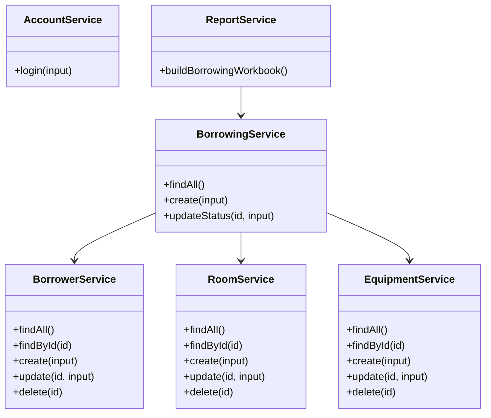

# Spesifikasi Program: Sistem Peminjaman Ruang dan Peralatan

## Tech Stack

- Next.js + TypeScript untuk aplikasi full-stack.
- Supabase PostgreSQL sebagai database relasional.
- Prisma ORM untuk schema, migrasi, dan query database.
- Zod untuk validasi input sebelum database.
- ExcelJS untuk export laporan.
- Vitest untuk unit test validasi kritis.
- Login sederhana berbasis `Account` dengan role `ADMIN`, `MAHASISWA`, dan `DOSEN`.

## Wireframe

## ERD

## Class Diagram

## Hak Akses

- `ADMIN` dapat mengelola peminjam, ruang, peralatan, seluruh peminjaman, pembaruan status, dan export laporan.
- `MAHASISWA` dan `DOSEN` hanya dapat mengajukan peminjaman untuk akunnya sendiri dan melihat riwayat milik sendiri.
- Status `DISETUJUI`, `DITOLAK`, dan `SELESAI` hanya dapat diubah oleh admin.

## Validasi

- Field wajib tidak boleh kosong.
- Format tanggal harus valid.
- Durasi peminjaman harus lebih dari 0 jam.
- Jumlah peralatan yang dipinjam tidak boleh melebihi stok.
- Status peminjaman hanya boleh `MENUNGGU`, `DISETUJUI`, `DITOLAK`, atau `SELESAI`.
- Aksi admin dibatasi oleh role di server action dan halaman route.

## Unit Test

Unit test tersedia di `src/lib/validation.test.ts` dan menguji:

- Field wajib.
- Durasi nol atau negatif.
- Jumlah pinjam melebihi stok.
- Data peminjaman valid.
